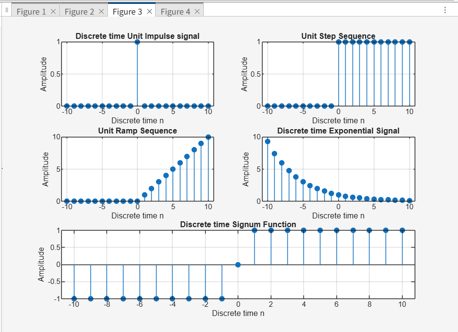
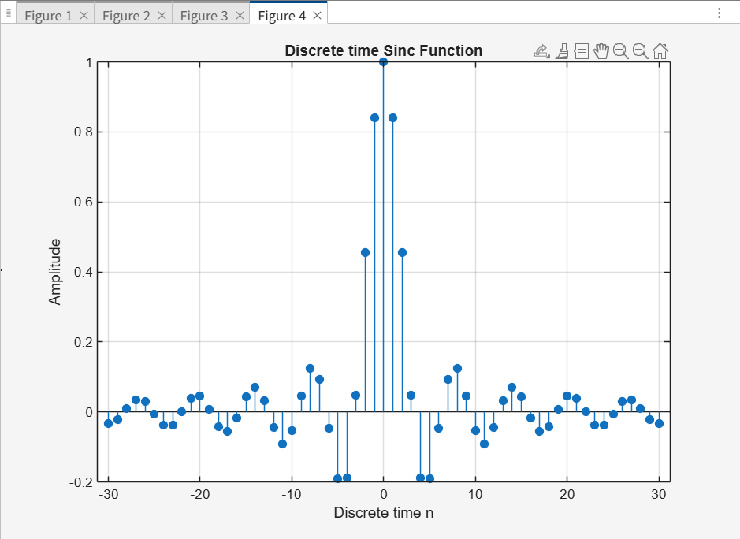

# Discrete-Time Signal Generation in MATLAB

This repository contains MATLAB code to generate and visualize six fundamental **discrete-time signals**.  
The purpose of this project is to understand the mathematical definitions of these signals and how to represent them visually — a core skill for any **signal processing, data, or AI engineer**.

---

## 📌 Signals Implemented

The `signals.m` script generates the following signals:


1. **Unit Impulse Signal**  
   - A signal that is 1 at time `n = 0` and 0 everywhere else.  

2. **Unit Step Signal**  
   - A signal that is 1 for `n ≥ 0` and 0 for `n < 0`.  

3. **Unit Ramp Signal**  
   - A signal that is equal to `n` for `n ≥ 0` and 0 for `n < 0`.  

4. **Exponential Signal**  
   - A signal of the form `x[n] = a^n`.  
   - This code uses a **decaying signal** (`a = 0.5`) for clear visualization.  

5. **Signum Signal**  
   - A signal that is `1` for positive `n`, `-1` for negative `n`, and `0` at `n = 0`.



6. **Sinc Signal**  
A signal defined as:

`sinc(n) = sin(π n) / (π n)`


---

## 📊 Simulation Results

The script generates plots of all six signals, organized in a **3×2 grid** for easy comparison.  

*(Sample plots will appear here once the script is executed.)*

---

## 🚀 How to Run the Code

1. **Clone the Repository**  
   Clone or download this repository to your local machine:
   ```bash
   git clone https://github.com/your-username/week2-signals-matlab.git
